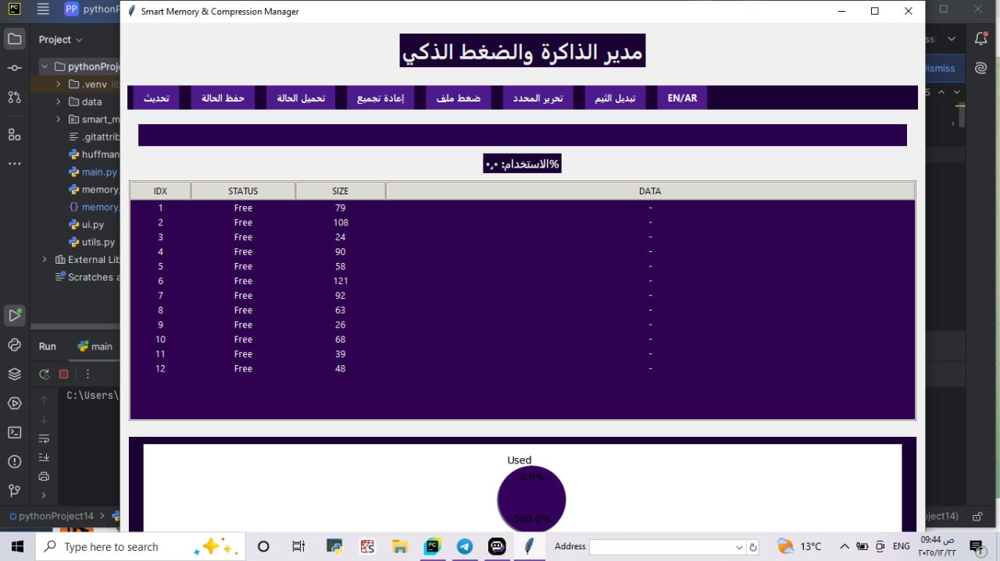
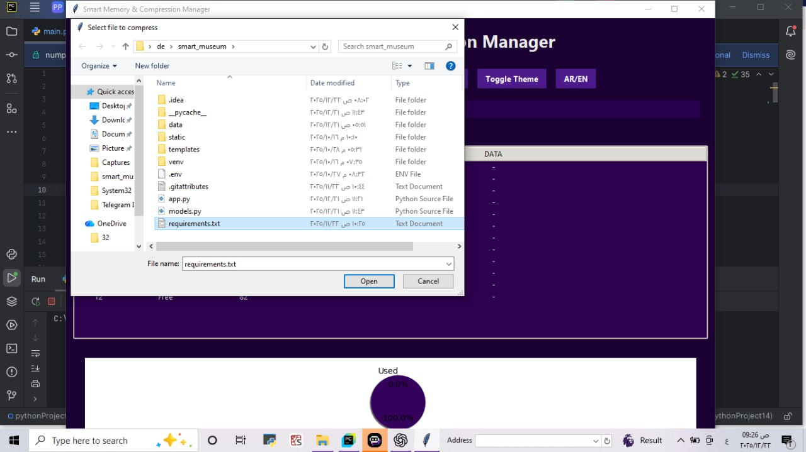

# 🧠 Smart Memory & Compression Manager

A Python-based system that combines file compression using Huffman algorithm with smart memory management techniques.

---

## 🚀 Features

- 📦 File compression using Huffman Coding
- 📂 Save and load compression tree
- 🧠 Memory allocation with policies (Best Fit, LRU)
- 🧵 Multithreading for background processing
- 🏭 Factory Design Pattern for extensibility
- 🎨 Configurable UI settings

---
## 📸 Screenshots

